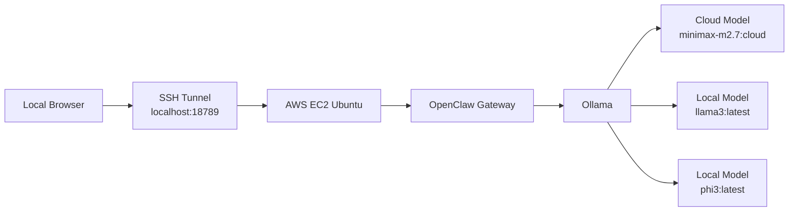

# OpenClaw Agents

An OpenClaw-based agent lab that demonstrates how to run OpenClaw on AWS EC2, connect securely over SSH tunneling, use Ollama with both cloud and local models, and switch models from the dashboard when cloud usage limits are hit.

## Overview

This project documents a practical OpenClaw deployment built on Ubuntu EC2 with Ollama as the model provider. The setup supports:

- OpenClaw running on an AWS EC2 instance
- Secure local access through SSH port forwarding
- Ollama cloud and local models registered in OpenClaw
- Dashboard model switching for recovery from cloud rate limits
- A documented path toward agent automations and external integrations

  ## Screenshots
  


## Features

- EC2-hosted OpenClaw gateway bound to loopback for safer access
- SSH tunnel workflow from Windows to the EC2-hosted dashboard
- Multiple Ollama models exposed in the OpenClaw model dropdown
- Cloud-first setup with local fallbacks
- Sanitized example configuration for reproducible setup
- Architecture and setup notes for GitHub proof and portfolio use

## Architecture



## Repo Structure

```text
openclaw-agents/
├─ README.md
├─ .gitignore
├─ docs/
│  ├─ setup.md
│  ├─ architecture.md
│  └─ screenshots.md
├─ configs/
│  └─ openclaw.example.json
└─ examples/
   └─ ssh-tunnel.txt
```

## Tech Stack

- OpenClaw
- Ollama
- AWS EC2
- Ubuntu 24.04
- SSH tunneling
- Local and cloud LLMs

## Registered Models

This setup is designed to expose multiple models in the OpenClaw dashboard dropdown:

- `ollama/minimax-m2.7:cloud`
- `ollama/llama3:latest`
- `ollama/phi3:latest`

Recommended default behavior:

- Primary: `ollama/minimax-m2.7:cloud`
- Fallback: `ollama/llama3:latest`

`phi3:latest` can still be registered for experimentation, but it may not be the best choice for tool-heavy agent workflows.

## Example Workflow

1. Start OpenClaw on the EC2 instance.
2. Create an SSH tunnel from the local machine to `127.0.0.1:18789` on EC2.
3. Open `http://localhost:18789` in the browser.
4. Select a model from the dashboard dropdown.
5. If the cloud model hits a rate limit, switch to a local fallback like `llama3:latest`.

## Setup

Detailed setup steps live in [docs/setup.md](/C:/Users/BIT/Documents/New%20project/openclaw-agents/docs/setup.md).

The example OpenClaw config lives in [configs/openclaw.example.json](/C:/Users/BIT/Documents/New%20project/openclaw-agents/configs/openclaw.example.json).

## Screenshots To Add

Add your own screenshots under a GitHub repo or image host and link them here:

- OpenClaw dashboard running on `localhost:18789`
- EC2 terminal showing OpenClaw gateway startup
- Ollama model list
- Model dropdown with multiple registered models
- Successful agent response

See [docs/screenshots.md](/C:/Users/BIT/Documents/New%20project/openclaw-agents/docs/screenshots.md) for a suggested screenshot checklist.

## Challenges Solved

- Fixed Ollama provider registration issues in OpenClaw
- Corrected model naming mismatches between Ollama and OpenClaw
- Resolved local access through SSH tunnel to a loopback-bound gateway
- Added multiple models so the dashboard can switch when cloud limits are reached
- Investigated device pairing, tool scope, and OAuth flow issues during setup

## Security Notes

- Do not commit real tokens, API keys, OAuth callback URLs, or private SSH keys
- Keep OpenClaw bound to loopback unless you intentionally harden and expose it
- Rotate any secrets that were accidentally shared during testing

## Next Improvements

- Add a systemd service for automatic gateway startup
- Add screenshots and a short demo video
- Add a local tool-friendly fallback model such as `qwen2.5:3b`
- Document Telegram, Tavily, and Google OAuth integrations with sanitized examples

## License

Choose a license before publishing publicly. MIT is a common starting point for portfolio repositories.
